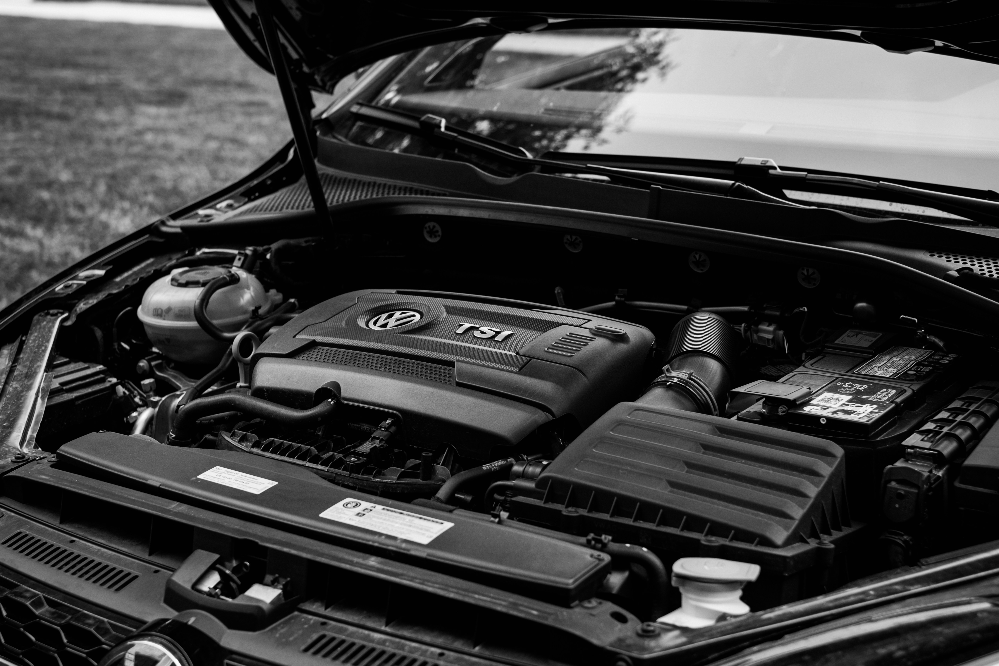

Learning how to jumpstart a car is an essential skill every driver
should master. A dead battery can leave you stranded at the worst
possible moment. The process involves connecting jumper cables from a
working vehicle\'s battery to your dead battery, allowing electrical
current to flow, and restarting your engine. This simple procedure can
save you time, money, and frustration.

Dead car batteries remain one of the most common roadside emergencies.
Understanding this process empowers you to handle the situation
confidently and safely.

## How Can You Jumpstart a Car Quickly and Safely?

To jumpstart a car, you need jumper cables and another running vehicle.
Position the working car close to yours without touching. Connect the
red cable to the positive terminal of the dead battery, then to the
positive terminal of the good battery. Attach the black cable to the
negative terminal of the good battery, then to an unpainted metal
surface in your engine bay. Start the working vehicle, wait a few
minutes, then try starting your car.

## Why Car Batteries Die: Understanding the Problem

Car batteries can die for many reasons. Cold weather makes them lose
power faster, and leaving the lights or music system on can drain them
completely. As a battery gets older, it naturally becomes weaker, and
rust or buildup on the terminals can stop it from working properly. Even
when your car is parked, modern vehicles have small systems that keep
using power. These "phantom drains" can slowly empty the battery if the
car isn't used for several days. Knowing these common causes can help
you avoid getting stuck with a dead battery.

## Essential Equipment for Jumpstarting

You need specific equipment to safely jumpstart your vehicle. Jumper
cables are essential - choose cables that are at least 12 feet long with
thick gauge wire. Safety gloves protect your hands from sparks and
corrosion. Safety glasses shield your eyes from potential battery acid
splashes.

A working vehicle with a 12-volt battery system is required. The helper
vehicle should have a similar voltage - never attempt to jump a car
battery with a truck\'s 24-volt system. Some portable jump starters can
replace the need for another vehicle entirely.

## Step-by-Step Guide: How to Jumpstart a Car Safely?

### **1. Preparation Phase**

Park the working vehicle close enough so jumper cables reach both
batteries easily. Turn off both engines and engage the parking brakes.
Remove keys from both vehicles. Open both hoods and locate the
batteries.

Inspect both batteries for cracks, leaks, or excessive corrosion. Clean
battery terminals if they appear dirty or corroded. Identify positive
and negative terminals on both batteries clearly.

### **2. Cable Connection Process**

Connect the red jumper cable to the positive terminal of the dead
battery first. Attach the other red cable end to the positive terminal
of the good battery. Connect the black cable to the negative terminal of
the working battery.

For the final connection, attach the remaining black cable end to an
unpainted metal surface in your engine bay - never to the negative
terminal of the dead battery. This prevents dangerous sparks near the
battery.

### **3. Starting Procedure**

Start the working vehicle and let it run for 2-3 minutes. This charges
your dead battery slightly. Turn the key in your vehicle - it should
start immediately or after a few attempts.

If your car doesn\'t start after several tries, wait a few more minutes
before attempting again. The dead battery may need more charging time.

### **4. Removal Process**

Once your car starts successfully, remove cables in reverse order.
Remove the black cable from your engine ground first. Take off the black
cable from the good battery\'s negative terminal. Remove the red cable
from the good battery, then finally from your battery.

Keep your engine running for at least 30 minutes to recharge the battery
through your alternator.

## How Long Do Car Batteries Last: What to Expect?

Most car batteries last between 3 and 5 years under normal conditions.
Climate significantly affects battery lifespan - extreme heat and cold
reduce longevity. Frequent short trips prevent batteries from fully
charging, shortening their life.

Quality batteries from reputable manufacturers typically last longer
than cheaper alternatives. Regular maintenance, including cleaning
terminals and checking fluid levels, extends battery life considerably.

**Quick stat:** Recent research from **[Geotab]{.underline}** analyzing
data from **10,000** vehicles shows that EV batteries now degrade at an
average of **1.8%** per year in 2024, a significant improvement from
previous years.

## Common Mistakes That Lead to Problems

Never smoke or create sparks near batteries - they can produce explosive
hydrogen gas. Don\'t let the cable ends touch each other while connected
to batteries. Avoid jumpstarting frozen batteries, which can crack or
explode.

Don\'t attempt to jumpstart vehicles with different voltage systems.
Remove jewelry and loose clothing that might contact battery terminals.
Never jumpstart a visibly damaged or leaking battery.

## When Professional Help Is Needed?

Some situations require professional assistance. If your battery is
cracked, swollen, or leaking, don\'t attempt jump-starting. Vehicles
with complex electrical systems may need special procedures.

According to data shared by the **American Automobile Association (AAA)
with The Times**, the organization provided roadside assistance to
160,000 electric vehicles in 2023, a 180% increase compared to 2019.
This highlights the growing complexity of modern vehicle electrical
systems. For emergency roadside assistance and professional battery
services, **[AAA]{.underline}** offers nationwide coverage and expert
technicians.

If jump-starting your car fails multiple times, the issue may be with
the alternator or starter. In such cases, a professional diagnosis is
necessary to uncover problems beyond a simple dead battery.

## Preventing Future Dead Battery Situations

-   **Test regularly:** Check your battery's voltage monthly with a
    > multimeter.

-   **Keep it clean:** Clean the terminals every few months using a
    > baking soda solution.

-   **Replace on time:** Change your battery every 3--4 years,
    > especially in extreme climates.

-   **Avoid drains:** Don't leave lights or accessories on when the
    > engine isn't running.

-   **Use a battery tender:** Helpful if your car is stored for long
    > periods.

-   **Drive often:** Take your car for regular drives to keep the
    > battery charged. Short trips may not give the alternator enough
    > time to recharge it fully.

## Alternative Solutions: Portable Jump Starters

Portable jump starters offer independence from other vehicles. These
compact devices contain powerful lithium batteries capable of starting
most cars. They\'re particularly useful in remote areas or during
emergencies.

Quality portable jump starters cost between \$50-200 but provide peace
of mind. Many include additional features like USB charging ports and
emergency lights. Keep them charged and ready in your vehicle.

## Understanding Your Vehicle\'s Electrical System

Modern vehicles are built with complex electrical systems that can
affect how jump-starting is done. In some cars, the battery may be
located in the trunk or under a seat rather than under the hood, while
others come equipped with dedicated jump-starting terminals in the
engine bay.

Because each manufacturer designs its electrical system differently,
it's important to know the specifics of your car. With
**[hyperDart]{.underline}** search, you can access detailed information
on a wide range of vehicles. The platform provides specifications, MSRP,
car details, and more for manufacturers such as Acura, Audi, BMW, Buick,
Cadillac, and Chevrolet. You can also explore information about
different car body types, making it easier to understand your vehicle's
unique design and requirements.

**Pro-Tip:** Always check your owner's manual for model-specific
jump-starting instructions, as some vehicles require special steps to
avoid damaging sensitive electronic components. Combining your manual's
guidance with reliable search tools like hyperDart ensures you're
following the right procedures for your car.

## Conclusion: Mastering This Essential Skill

Knowing how to jumpstart a car provides confidence and independence on
the road. This straightforward procedure can resolve most dead battery
situations quickly and safely. Remember to prioritize safety, follow
proper procedures, and maintain your equipment regularly.

Keep jumper cables or a portable jump starter in your vehicle at all
times. Practice the procedure when your battery is working to become
familiar with the process. With proper knowledge and preparation, a dead
battery becomes a minor inconvenience rather than a major emergency.

Regular battery maintenance and awareness of warning signs help prevent
dead battery situations entirely. When jump starting becomes necessary,
follow these guidelines for safe and successful results every time.

## Frequently Asked Questions: How to Jumpstart A Car

### How to properly jumpstart a car battery?

To properly jump start a car, connect red cables to positive terminals
first, then black cables - one to the good battery\'s negative terminal
and the other to the engine ground. Start the working vehicle, wait a
few minutes, then start your car.

### How to jump a car when the battery is completely dead?

When your battery is completely dead, the process remains the same but
may take longer. Let the working vehicle run for 5-10 minutes before
attempting to start your car. Multiple attempts might be necessary for
severely discharged batteries.

### How long do car batteries last in different climates?

Car batteries typically last 3-5 years, but the climate affects
longevity significantly. Hot climates can reduce battery life to 2-3
years, while moderate climates may extend life to 5-6 years. Cold
weather reduces capacity but doesn\'t necessarily shorten overall
lifespan.

### What do you need to jump-start a car safely?

To jump-start a car, you need jumper cables (at least 12 feet long), a
working vehicle with a 12-volt battery, safety gloves, and safety
glasses. Position both vehicles close enough for cables to reach without
touching. Always have the working vehicle\'s engine running before
attempting to start your dead battery.

### Can you jumpstart a car with a completely dead battery, and will it damage the alternator?

Yes, you can jumpstart a car with a completely dead battery without
damaging the alternator. However, let the working vehicle charge your
dead battery for 5-10 minutes before starting attempts. Once your car
starts, drive for at least 30 minutes to allow the alternator to
properly recharge the battery. If your battery frequently dies, have it
tested as it may need replacement.
